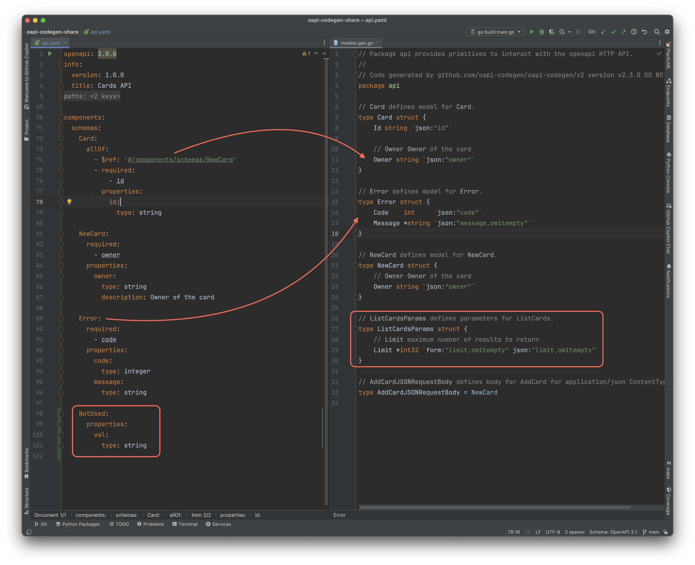
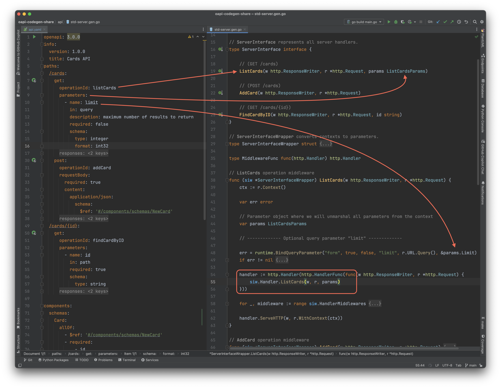
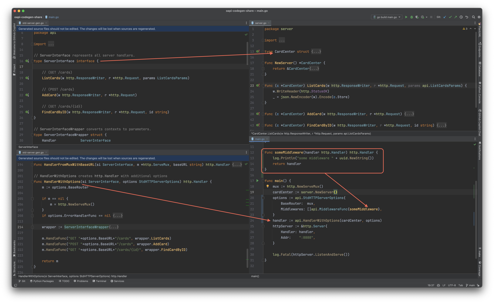

# oapi-codegen-share

This is a simple introduction of how to generate code from OpenAPI(Swagger) specifications using the `oapi-codegen`
tool.

## What?

`oapi-codegen` is a command-line tool and library to convert OpenAPI specifications to Go code

* server-side boilerplate
* client API boilerplate
* HTTP models
* Middleware support
* Custom templates

## Why?

### Pros

1. less hand-coding => less errors
2. template-based generation => consistent code
3. save time => save money

### Cons

1. coding style relies on templates
2. not all features are supported
3. might increase complexity, you can't get tailored templates by default

## How?

### 1. Binary

```shell
# binary install
go install github.com/oapi-codegen/oapi-codegen/v2/cmd/oapi-codegen@latest

oapi-codegen --help
```

### 2. Go generate

1. use `tools.go` to install the dependencies
2. create go file with
   ```go
   package gen
 
   //go:generate go run github.com/oapi-codegen/oapi-codegen/v2/cmd/oapi-codegen --config=config.yaml ../../api.yaml

   ```
3. run `go generate ./...`

Example: [Makefile](./Makefile)

## Generated Code

OpenAPI Spec: [api.yaml](./api.yaml)

### Models

```shell
oapi-codegen -generate types -package api -o gen/models.gen.go api.yaml
```



### Server

Support List

* Chi
* Echo
* Fiber
* Gin
* gorilla/mux
* Iris
* 1.22+ net/http

```shell
oapi-codegen -generate std-http -package api -o gen/std-server.gen.go api.yaml
```

It
renders [std-http-middleware.tmpl](https://github.com/oapi-codegen/oapi-codegen/blob/main/pkg/codegen/templates/stdhttp/std-http-middleware.tmpl)
based on the OpenAPI specification.



### Client

```shell
oapi-codegen -generate client -package api -o gen/client.gen.go api.yaml
```

## Integration

### Server



## Update service (non-breaking change)

* Add new endpoints (Live demo)
* Adding new request parameter
* Adding new response fields

## Customization

1. [OpenAPI extensions](https://github.com/oapi-codegen/oapi-codegen/tree/main?tab=readme-ov-file#openapi-extensions) (Live demo)
2. [Custom code generation](https://github.com/oapi-codegen/oapi-codegen/tree/main?tab=readme-ov-file#custom-code-generation)

## Q&A
